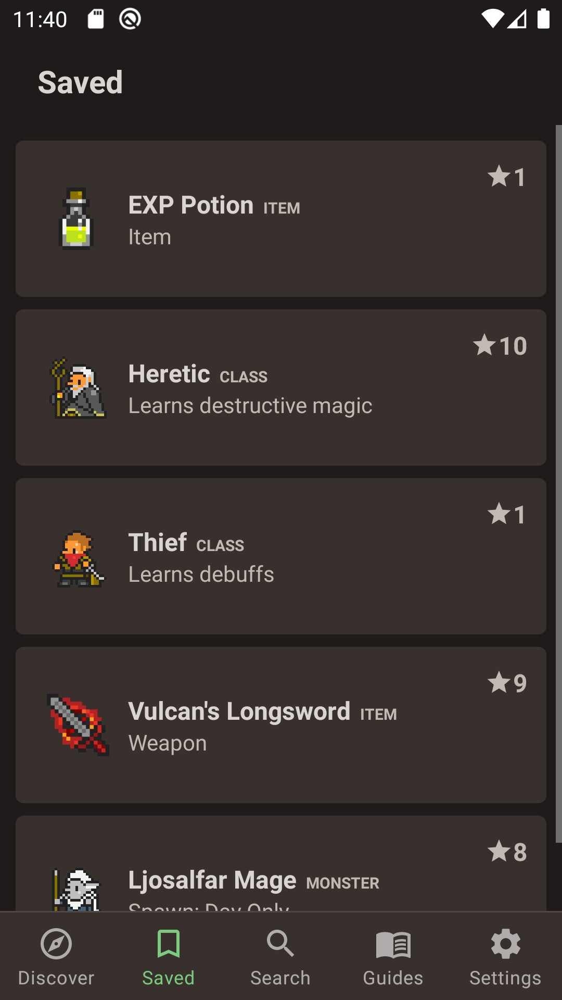
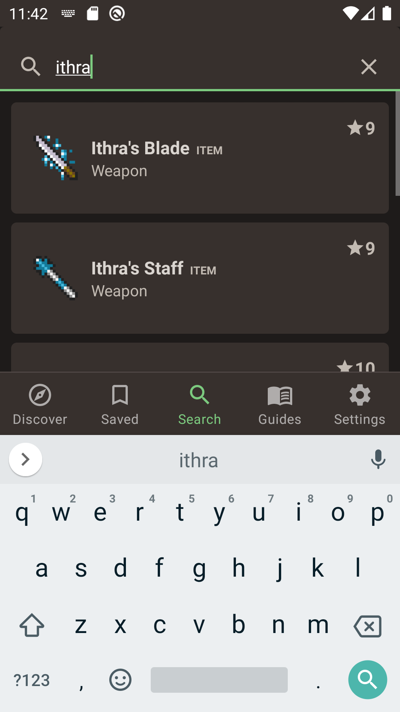
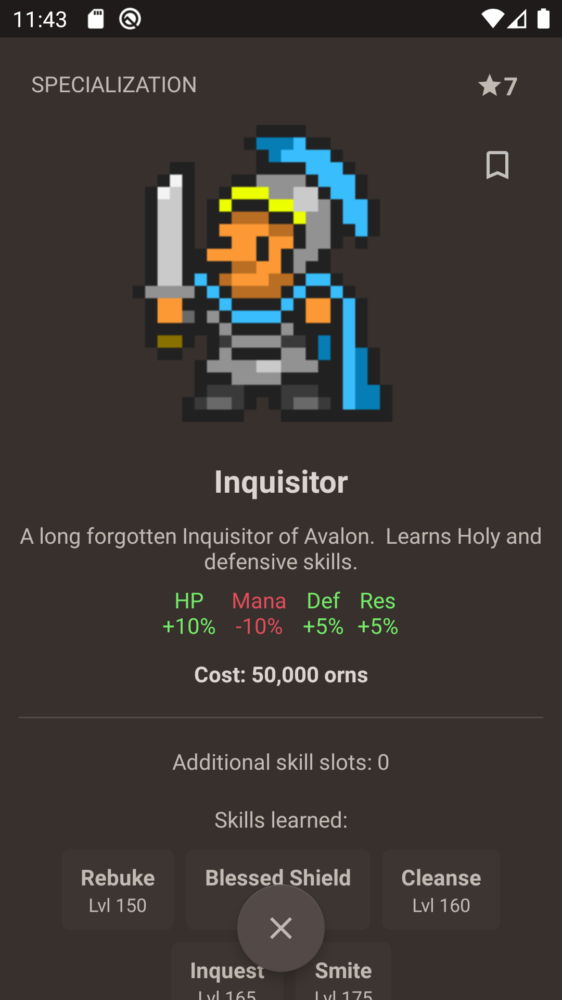

# Orna Companion
Orna Companion is an Android/iOS app for OrnaRPG. It fetches and displays data from Orna.Guide.

## Features
- Multiple choice mode. Practice your flashcards in multiple choice mode. You need at least 5 cards to start this mode.
- Typed rehearsal mode. Type your answer and check if the back of the card has the correct answer. Useful for vocabulary exercises.
- Memory mode. Practice in your mind.
- Organize your cards in stacks.
- Language pronounciation. Everytime you get a correct answer, automatically pronounce the correct answer.
- Shuffling cards. Shuffle the order of your flashcards.
- Reversing cards.
- Backup all cards.
- Repeat incorrect cards.
- Import and export to CSV format.
- Manually or automatically sort cards.

## Contributing
You help by creating an issue or a PR.

## Screenshots
Multiple Choice            |  Cards                    |  Typed mode
:-------------------------:|:-------------------------:|:-------------------------:
 |  |  

## Privacy policy

<a href="https://www.notion.so/bryanderidder/Privacy-Policy-4120cbe4c26848a68e448bf5613e3dd1" rel="privacy policy">Read it here.</a>
